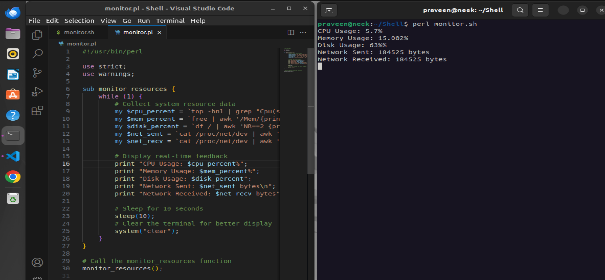
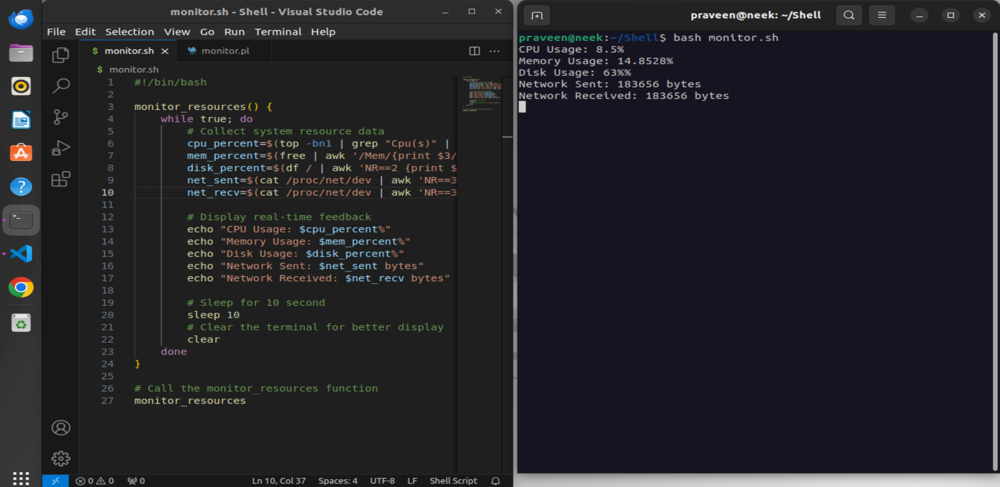

# System Resource Monitor

Monitor system resources with shell and Perl scripts.

## Description

This repository contains shell and Perl scripts for monitoring system resource usage such as CPU, memory, disk, and network in real-time.

## Instructions

1. **Clone the Repository:**

    ```bash
    git clone https://github.com/praveensg0/monitor_resources.git
    ```

2. **Navigate to the Directory:**

    ```bash
    cd monitor_resources
    ```


**Note:** Ensure necessary permissions for execution.

## Usage

### Shell Script

1. Make sure you have permission to execute the shell script:

    ```bash
    chmod +x monitor_resources.sh
    ```

2. Run the shell script:

    ```bash
    ./monitor.sh
    ```

### Perl Script

1. Run the Perl script:

    ```bash
    perl monitor_resources.pl
    ```

## Demo




Here's a brief demo of the system resource monitor in action.

## Contributing

Contributions are welcome! Feel free to open issues or submit pull requests.

## License

This project is licensed under the [MIT License](LICENSE).
